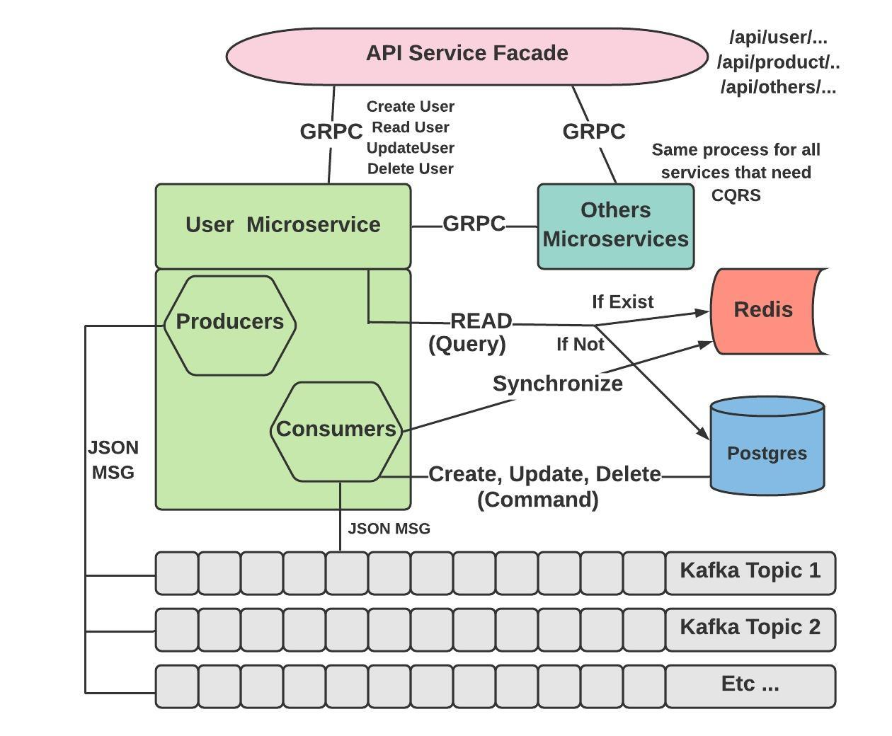

# cqrs-kafka-golang

## Overview

## Start Kafka
- zookeeper

C:\kafka_2.13-2.4.0\bin\windows/zookeeper-server-start.bat C:\kafka_2.13-2.4.0\config/zookeeper.properties

- kafka

C:\kafka_2.13-2.4.0\bin\windows/kafka-server-start.bat C:\kafka_2.13-2.4.0\config/server.properties

## Create Topic
From user.go:
- createUserTopic   = "user-create"
- updateUserTopic   = "user-update"
- deleteUserTopic   = "user-delete"

C:\kafka_2.13-2.4.0\bin\windows/kafka-topics.bat –create –zookeeper kafka-zookeeper:2181 –replication-factor 1 –partitions 1 –topic user-create

C:\kafka_2.13-2.4.0\bin\windows/kafka-topics.bat –create –zookeeper kafka-zookeeper:2181 –replication-factor 1 –partitions 1 –topic user-update

C:\kafka_2.13-2.4.0\bin\windows/kafka-topics.bat –create –zookeeper kafka-zookeeper:2181 –replication-factor 1 –partitions 1 –topic user-delete

## To see your messages

C:\kafka_2.13-2.4.0\bin\windows/kafka-console-consumer.bat -bootstrap-server kafka-zookeeper:9092 -topic user-create -from-beginning

## Run Redis

docker run -d -p 6379:6379 --name redis redis

docker exec -it redis  redis-cli

## Run Postgresql
docker run -d -p 5432:5432 --name postgresql -e POSTGRES_PASSWORD=password postgres

docker exec -it postgresql /bin/sh

psql -h localhost -U postgres

docker exec -it postgresql psql -h localhost -U postgres

CREATE DATABASE cqrs;

\connect cqrs

CREATE TABLE cqrs_user(
   userid serial PRIMARY KEY,
   firstname VARCHAR (50) NOT NULL,
   lastname VARCHAR (50) NOT NULL,
   age integer NOT NULL,
   updatedate date NOT NULL,
   createdate date NOT NULL
);

CREATE TABLE cqrs_product(
   productid serial PRIMARY KEY,
   name VARCHAR (50) NOT NULL,
   description VARCHAR (50) NOT NULL,
   updatedate date NOT NULL,
   createdate date NOT NULL
);

SELECT * FROM cqrs_user

## Test
*ToDo fix to respect RestFull Api Method*

curl http://localhost:8080/api/user/create/firstname/myfirst0/lastname/mylast0/age/31/

curl http://localhost:8080/api/user/create/firstname/myfirst1/lastname/mylast1/age/32/

curl http://localhost:8080/api/user/create/firstname/myfirst2/lastname/mylast2/age/33/

curl http://localhost:8080/api/user/create/firstname/myfirst3/lastname/mylast3/age/34/

curl http://localhost:8080/api/user/read/4/

curl http://localhost:8080/api/user/update/4/firstname/myfirst4/lastname/mylast4/age/35/

curl http://localhost:8080/api/user/delete/4/